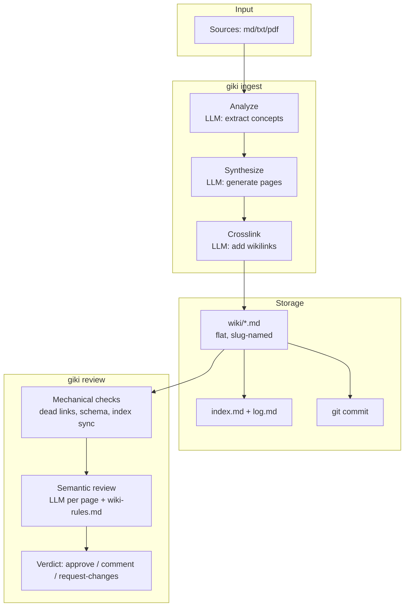

# giki

> Software-engineering approach to LLM Wikis.

[](https://github.com/MeloMei/giki/actions/workflows/ci.yml)
[](https://pypi.org/project/giki-gitwiki/)
[](https://opensource.org/licenses/MIT)
[](https://www.python.org/downloads/)

**giki** treats knowledge like code. Raw documents (markdown, text, PDF) are *compiled* into structured wiki pages by an LLM, then managed through git with AI-powered PR review. Think of it as **CI/CD for knowledge**.

[Chinese README](docs/README-CN.md) | [Design Spec](docs/superpowers/specs/2026-06-30-giki-v0.1-design.md)

---

## Why giki?

Most LLM knowledge tools either retrieve at query time (RAG) or generate content without quality control. giki takes a third path:

**Compile, don't retrieve.** Instead of searching through raw documents every time you ask a question, giki compiles sources into structured, interlinked wiki pages *once* at ingest time. The result is a navigable knowledge graph you can browse directly in Obsidian.

**Review like code.** Every change goes through a two-phase review pipeline: mechanical checks (dead links, schema validation) catch bugs deterministically, while an LLM reviewer evaluates semantic quality against your team's wiki rules. All of this runs as a GitHub Action on pull requests.

**Git-native.** Every AI-generated page is a normal git commit. You can `git diff` to see exactly what the LLM changed, `git log` to trace knowledge evolution, and `git revert` to undo bad edits. No proprietary database, no vendor lock-in.

---

## Features

**Two-phase compilation pipeline**
Analyze (extract candidate concepts from source chunks) → Synthesize (generate/rewrite wiki pages) → Crosslink (add `[[wikilinks]]` and `## Related` blocks).

**AI PR Review Bot**
Mechanical checks run first (zero false positives): dead links, frontmatter schema, index sync, unrelated edit detection. Then per-page LLM semantic review cites your `wiki-rules.md` rules by anchor (e.g. `R-1 consistency`). Verdicts: `approve` / `comment` / `request-changes`.

**Git-native version control**
Each ingest produces a clean commit (`ingest: observer.md — 3 of 3 pages`). Branch isolation with `--branch wiki/<topic>`. Full diff/revert/rebase support.

**Obsidian-compatible output**
Standard YAML frontmatter + `[[wikilink]]` syntax. Point Obsidian at your `wiki/` directory and browse immediately.

**Smart indexing**
`index.md` (categorized directory) and `log.md` (chronological timeline) are auto-maintained. No manual bookkeeping.

---

## Architecture



---

## Quick Start

### Prerequisites

- Python 3.11+
- git
- An LLM API key (Anthropic or any OpenAI-compatible endpoint)

### Install

```bash
pip install giki-gitwiki
```

Or from source:

```bash
git clone https://github.com/MeloMei/giki.git
cd giki
pip install -e ".[dev]"
```

### Initialize a knowledge base

```bash
mkdir my-kb && cd my-kb
git init
giki init
```

This creates `.giki/config.yaml`, `wiki-rules.md`, `wiki/`, `sources/`, `index.md`, and `log.md`.

### Configure your LLM

Edit `.giki/config.yaml`:

```yaml
llm:
  compile:
    provider: claude          # or "openai"
    model: claude-sonnet-4-5-20250929
    base_url: https://api.anthropic.com
    api_key_env: ANTHROPIC_API_KEY
  review:
    provider: claude
    model: claude-sonnet-4-5-20250929
    base_url: https://api.anthropic.com
    api_key_env: ANTHROPIC_API_KEY
```

For Ollama or any OpenAI-compatible endpoint:

```yaml
llm:
  compile:
    provider: openai
    model: llama3
    base_url: http://localhost:11434/v1
    api_key_env: OLLAMA_API_KEY
```

Then set your API key:

```bash
export ANTHROPIC_API_KEY=sk-ant-...
```

### Ingest a document

```bash
cp ~/notes.md sources/
giki ingest sources/notes.md --branch wiki/my-first-ingest --yes
```

giki will analyze the source, propose wiki pages, generate them via LLM, add crosslinks, update `index.md` and `log.md`, and commit everything to the `wiki/my-first-ingest` branch.

### Review changes

```bash
# Local review (HEAD vs main)
giki review

# Review a PR and post as comment
giki review --pr 42 --post

# JSON output for CI
giki review --json
```

---

## Commands

| Command | Description |
|---|---|
| `giki init [--with-action]` | Initialize a knowledge base. `--with-action` generates a GitHub Actions workflow. |
| `giki ingest <path...> [--branch NAME] [--yes] [--dry-run] [--retry-failed]` | Compile source documents into wiki pages. |
| `giki review [--pr N] [--post] [--json] [--base BRANCH]` | Two-phase review: mechanical checks + LLM semantic review. |
| `giki config show \| set <key> <value> \| tips` | Manage `.giki/config.yaml`. |

### Ingest flags

| Flag | Description |
|---|---|
| `--branch NAME` | Ingest on this branch (creates if missing). Strongly recommended. |
| `--yes` | Non-interactive mode; accept all candidate pages. |
| `--dry-run` | Print candidate pages without generating them. |
| `--retry-failed` | Bypass hash check and re-run the full pipeline (recovers from transient LLM failures). |

### Review flags

| Flag | Description |
|---|---|
| `--pr N` | Label the review with PR number N. Required with `--post`. |
| `--post` | Post the review as a PR comment via `gh pr comment`. |
| `--json` | Output structured JSON (for CI pipelines). |
| `--base BRANCH` | Base branch for diff comparison (default: `main`). |

Exit codes: `0` = approve or comment, `1` = request-changes.

---

## Review Pipeline

```
giki review
    |
    v
Phase 0  Context: load config + wiki-rules.md + determine diff range
    |
    v
Phase 1  Classify: NEW / UPDATED / DELETED / RENAMED (wiki vs index vs other)
    |
    v
Phase 2  Mechanical (no LLM):
           - Dead link detection (two-stage: filename -> alias)
           - Frontmatter schema validation
           - Slug pattern + length check
           - index.md sync (NEW pages must appear)
           - Unrelated edit ratio warning
    |
    v
Phase 3  Semantic (LLM per page):
           - Input: wiki-rules.md + before/after + mechanical findings
           - Output: findings with rule_id + severity + evidence + suggestion
           - Hand-written pages (no sources frontmatter) are skipped
    |
    v
Phase 4  Aggregate:
           - Any blocker finding -> request-changes
           - All approve -> approve
           - Otherwise -> comment
    |
    v
Phase 5  Output: markdown (default) / JSON (--json) / PR comment (--post)
```

### wiki-rules.md

Your team's review criteria, versioned in the repo. Each rule is anchored by `## R-N`:

```markdown
## R-1
**consistency** -- severity: `blocker`
Facts in different pages must not contradict each other.

## R-2
**citation integrity** -- severity: `blocker`
Non-trivial claims must trace back to a source.

## R-5
**paragraph length** -- severity: `nit`
Paragraphs over ~8 sentences should be split.
```

The semantic reviewer cites these anchors in its findings (e.g. `rule_id: R-2`).

---

## Configuration

`.giki/config.yaml` controls all behavior:

| Section | Key | Default | Description |
|---|---|---|---|
| `llm.compile` | `provider` | `claude` | LLM provider for ingestion (`claude` or `openai`) |
| | `model` | `claude-sonnet-4-5-20250929` | Model name |
| | `base_url` | `https://api.anthropic.com` | API endpoint (override for gateways) |
| | `api_key_env` | `ANTHROPIC_API_KEY` | Environment variable name for API key |
| `llm.review` | (same keys) | (same defaults) | Independent config for review LLM |
| `ingest` | `chunk_size` | `12000` | Sliding window size in characters |
| | `chunk_overlap` | `500` | Overlap between adjacent windows |
| `review` | `unrelated_edit_threshold` | `0.30` | Warn if >30% of changes are outside `wiki/` |
| | `severity_blocking` | `[blocker]` | Which severities trigger `request-changes` |
| | `pr_comment_collapse` | `true` | Collapse `nit` findings in PR comments |

`llm.compile` and `llm.review` are independent — use different providers/models for cross-validation.

---

## GitHub Action

Generate with `giki init --with-action`, or create `.github/workflows/giki-review.yml`:

```yaml
name: giki review
on:
  pull_request:
    paths: ['wiki/**', 'index.md', 'wiki-rules.md', '.giki/**']
jobs:
  review:
    runs-on: ubuntu-latest
    steps:
      - uses: actions/checkout@v4
        with: { fetch-depth: 0 }
      - uses: actions/setup-python@v5
        with: { python-version: '3.11' }
      - run: pip install giki-gitwiki
      - run: giki review --pr ${{ github.event.pull_request.number }} --post
        env:
          GH_TOKEN: ${{ secrets.GITHUB_TOKEN }}
          ANTHROPIC_API_KEY: ${{ secrets.ANTHROPIC_API_KEY }}
```

---

## Repository Layout

```
my-knowledge-base/
├── .giki/
│   └── config.yaml          # Model + threshold configuration
├── sources/                  # Raw documents (md, txt, pdf)
├── wiki/                     # LLM-compiled pages (flat, slug-named)
├── index.md                  # Auto-maintained categorized directory
├── log.md                    # Auto-maintained chronological timeline
├── wiki-rules.md             # Review rules (versioned with the repo)
└── .giki-state/              # SHA-256 tracking (gitignored by default)
```

---

## Known Limitations (v0.1)

1. **No PDF OCR** -- scanned PDFs are rejected. Only text-based PDFs are supported.
2. **No remote sources** -- URLs, Notion, Confluence are not supported. Local files only.
3. **No wikilink anchors** -- `[[page#heading]]`, `[[^block]]`, and `![[embed]]` are not supported.
4. **Flat wiki directory** -- no subdirectories in `wiki/`. Use `tags` in frontmatter for categorization.
5. **Manual retry** -- `--retry-failed` bypasses the hash check but doesn't persist per-page failure lists.
6. **No token estimation** -- cost control is manual. Monitor your API usage.

---

## Roadmap

**v0.2:**
- Typed wikilinks (`[[requires::X]]`, `[[contradicts::Y]]`, etc.)
- `giki branch` / `giki pr` collaboration commands
- AI merge (resolve PR conflicts)

**v0.3:**
- Local web UI (`giki serve` -- D3 knowledge graph + full-text search)
- Q&A (`giki chat` -- BM25 retrieval + RAG)
- Cross-domain knowledge fusion
- `giki lint --fix`

---

## Development

```bash
git clone https://github.com/MeloMei/giki.git
cd giki
python -m venv .venv
source .venv/bin/activate  # Windows: .venv\Scripts\activate
pip install -e ".[dev]"
pytest -q
```

See [CONTRIBUTING.md](CONTRIBUTING.md) for contribution guidelines.

---

## License

MIT. See [LICENSE](LICENSE).
