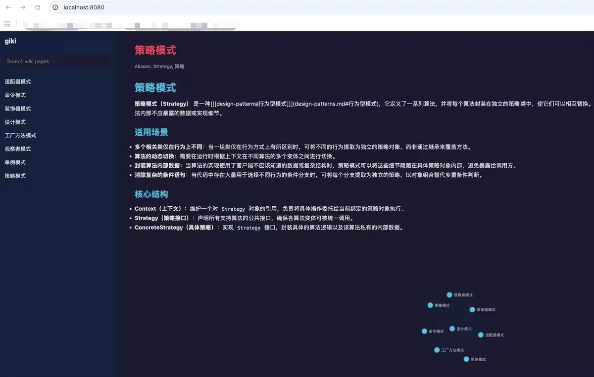
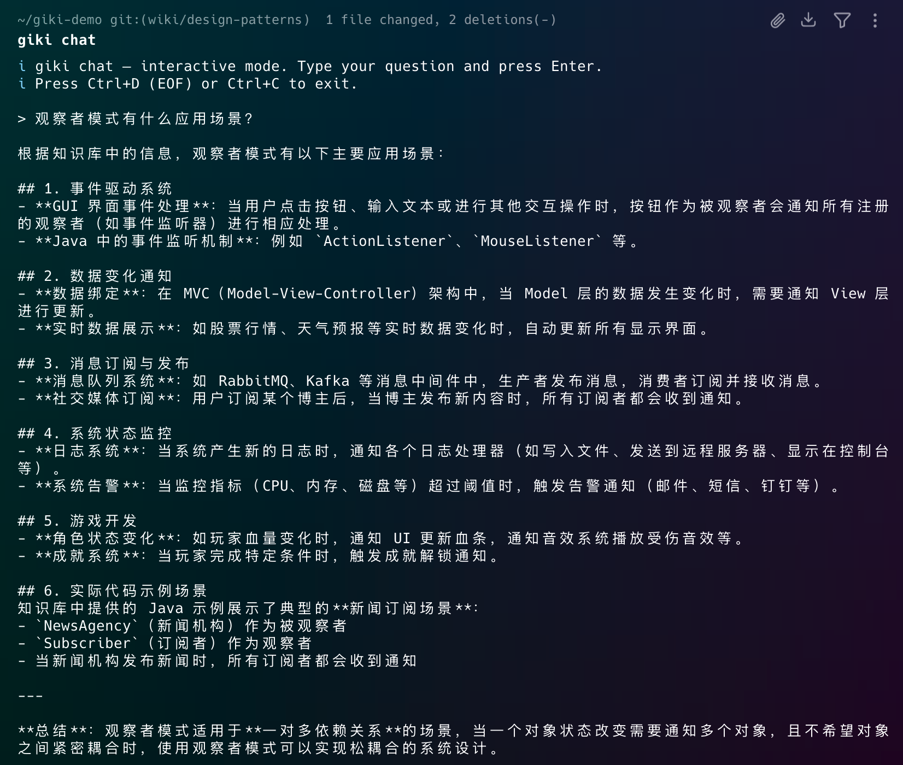

# giki

Git-native LLM Wiki — compile knowledge like code, review like a PR.

<p align="center">
<a href="https://github.com/MeloMei/giki/actions/workflows/ci.yml"></a>
<a href="https://pypi.org/project/giki-gitwiki/"></a>


</p>

<p align="center">
<a href="docs/README-CN.md"> 中文 </a>
</p>

---

Andrej Karpathy's LLM Wiki has become the new paradigm for knowledge management — shifting knowledge base construction from vector-based RAG to LLM-driven knowledge compilation. But team knowledge bases still need safe collaboration and proper quality gates.

Feed documents to an LLM, and it spits out wiki pages. That's where most tools stop — you end up with a pile of markdown, no defense against low-quality knowledge injection, no way for your team to collaborate on it, and no audit trail when things go wrong.

The name giki comes from "git wiki." It brings software engineering's git workflow into knowledge base construction, treating knowledge like code. Every AI modification is a revertable, auditable git commit. Teams work on branches and merge through pull requests. A GitHub-auto-review-like mechanism checks for dead links, semantic contradictions, and rule violations before anything lands in main.

Like CI/CD for your knowledge base.

| Solution Name       | Knowledge Processing | Version Control          | Collaboration Mode       | Content Validation       | Interface Form          | Knowledge Base Interoperability | Note Tool Compatibility |
|---------------------|----------------------|--------------------------|--------------------------|--------------------------|-------------------------|--------------------------------|-------------------------|
| Custom Solution     | ✅ Compiled-style    | ✅ Full Git lifecycle    | ✅ PR/branch workflow    | ✅ Semantic + rule check | ✅ Local zero-dependency | ✅ Joint index interoperability | ✅ Obsidian native compatible |
| Traditional RAG | ❌ Retrieval-style   | ❌ No version control    | ❌ No team collaboration | ❌ No automated review   | ✅ Cloud-based access   | ❌ No cross-base integration    | ❌ Incompatible with Obsidian |
| LLM Wiki | ✅ Knowledge compilation | ✅ Single-user versioning | ❌ No team collaboration | ❌ No automated validation | ⚠️ Partial support | ❌ No cross-base interoperability | ✅ Obsidian compatible |

## See it in action


**Starting a new knowledge base:**

```bash
mkdir my-kb && cd my-kb && git init
giki init
```

<p align="center"></p>

That scaffolds your directory with a config file, wiki-rules for the review bot, empty `wiki/` and `sources/` directories, and auto-maintained index and log files.

**Compiling a document into wiki pages:**

Drop a markdown file (or PDF) into `sources/` and run:

```bash
giki ingest sources/design-patterns.md --branch wiki/design-patterns --yes
```

<p align="center"></p>

giki analyzes the source, proposes candidate pages, generates them through your LLM, adds wikilinks between related concepts, updates the index, and commits everything to a branch. The whole pipeline runs in three phases: analyze, synthesize, crosslink. Sliding-window chunking means even long documents work without truncation.

**Reviewing changes before they merge:**

```bash
giki review --base main
```

<p align="center"></p>

The review bot runs mechanical checks first (dead links, frontmatter format, index sync) — zero false positives on these. Then it does per-page semantic review against your `wiki-rules.md`, citing specific rules by anchor. Verdicts are `approve`, `comment`, or `request-changes`.

**Browse the result in Obsidian:**

Point Obsidian at your `wiki/` directory and you get the full graph view with backlinks, local search, and wikilink navigation. No export needed.

<p align="center"></p>

**Launch a local web UI:**

```bash
giki serve
```

<p align="center"></p>

D3 knowledge graph visualization, full-text search, and a markdown page viewer — all in your browser at `localhost:8080`. No dependencies, pure Python stdlib.

**Ask your knowledge base questions:**

```bash
giki chat "观察者模式有什么应用场景？"
```

<p align="center"></p>

BM25 retrieves relevant pages, then the LLM generates an answer grounded in your wiki content.

## How it works

The core loop:

1. Raw documents go into `sources/`
2. giki's LLM engine extracts concepts and generates structured wiki pages
3. Crosslinks are added between related pages automatically
4. `index.md` (categorized directory) and `log.md` (timeline) update themselves
5. Everything gets committed as a clean git commit
6. When you open a PR, the review bot checks for problems
7. Your team discusses, refines, and merges

The review bot and the compile engine can use different LLMs — this is intentional. Cross-model validation catches hallucinations that a single model might miss.

## Get started

**Using an AI coding assistant?** Paste this to your agent:

> Read https://github.com/MeloMei/giki/blob/main/SETUP.md and set up the giki project for me.

Or install manually:

```bash
pip install giki-gitwiki
```

Initialize a knowledge base and configure your LLM in `.giki/config.yaml`:

```yaml
llm:
  compile:
    provider: claude
    model: claude-sonnet-4-5-20250929
    base_url: https://api.anthropic.com
    api_key_env: ANTHROPIC_API_KEY
  review:
    provider: openai
    model: gpt-4o
    base_url: https://api.openai.com/v1
    api_key_env: OPENAI_API_KEY
```

Works with Claude, GPT, Ollama, and any OpenAI-compatible endpoint.

## Commands

| Command | What it does |
|---|---|
| `giki init [--with-action]` | Set up a knowledge base. Add `--with-action` for GitHub Actions auto-review. |
| `giki ingest <path...> [--branch NAME] [--yes]` | Compile sources into wiki pages. |
| `giki review [--pr N] [--post] [--json]` | Run mechanical + semantic review. |
| `giki branch list \| create \| switch` | Manage branches for knowledge compilation. |
| `giki pr create \| list \| review \| merge` | Manage pull requests (requires gh CLI). |
| `giki lint [--fix]` | Check wiki health: dead links, orphans, frontmatter issues. `--fix` auto-repairs. |
| `giki serve [--port N]` | Start local web UI with D3 knowledge graph and search. |
| `giki chat ["question"]` | Ask your knowledge base questions. BM25 retrieval + LLM RAG. |
| `giki config show \| set <key> <value>` | Manage config. |
| `giki mcp-serve` | Start MCP server for platform integration. |

## MCP Server (for Claude Code / Codex)

giki can run as an MCP (Model Context Protocol) server, letting you use it directly inside Codex, Claude Code, or any MCP-compatible platform — no LLM API key needed.

```bash
pip install giki-gitwiki
```

Then add to your platform's MCP config:

```json
{
  "mcpServers": {
    "giki": {
      "command": "giki",
      "args": ["mcp-serve"]
    }
  }
}
```

After restarting the platform, you can ask it to initialize a knowledge base, ingest documents, or review changes — the platform's built-in LLM will drive giki's pipeline.

## Contributing

```bash
git clone https://github.com/MeloMei/giki.git
cd giki
pip install -e ".[dev]"
pytest -q
```

See [CONTRIBUTING.md](CONTRIBUTING.md) for the full guide.

## License

MIT
