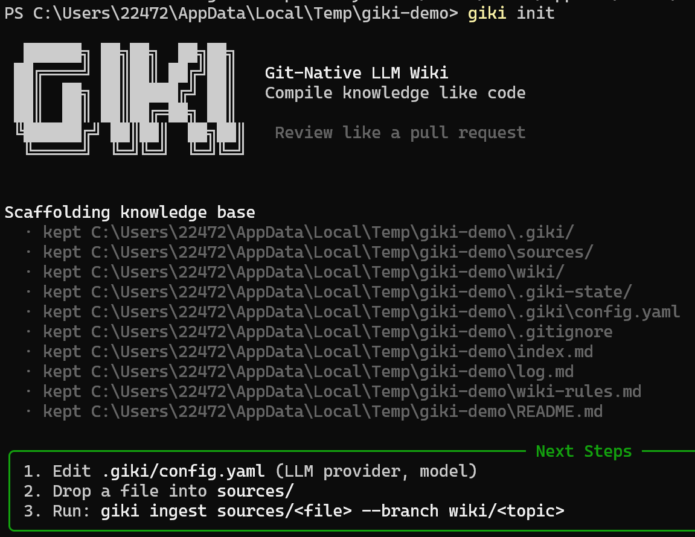
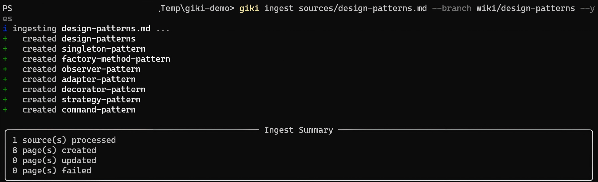
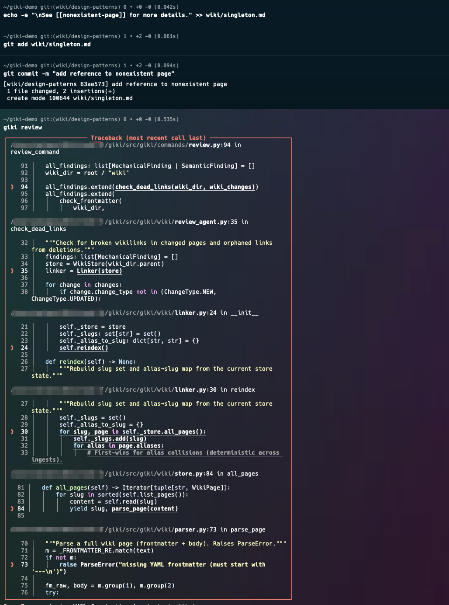
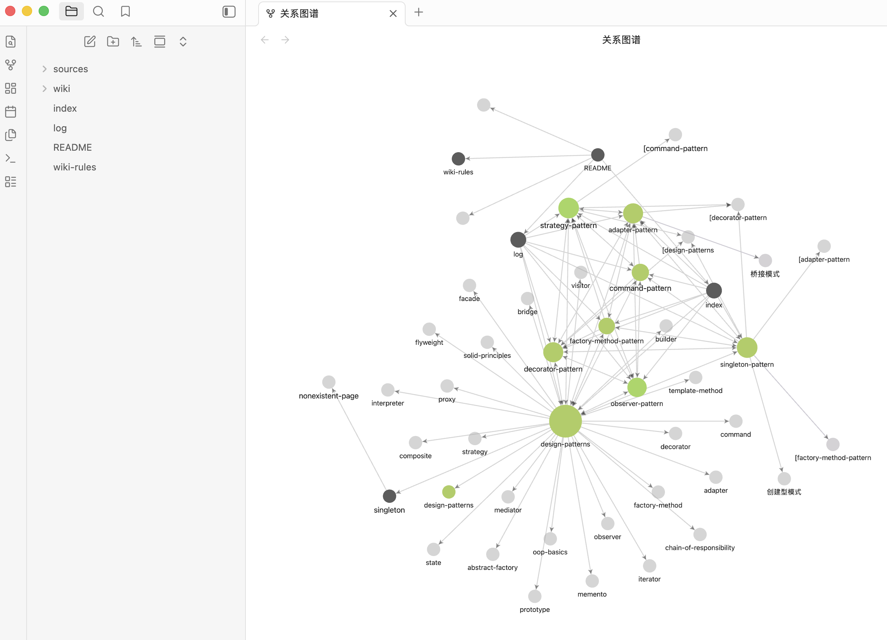

# giki

CI/CD for your knowledge base.

<p align="center">
<a href="https://github.com/MeloMei/giki/actions/workflows/ci.yml"></a>
<a href="https://pypi.org/project/giki-gitwiki/"></a>


</p>

<p align="center">
<a href="docs/README-CN.md"> 中文 </a>
</p>

---

Your code has CI/CD — every push triggers lint, tests, and review before anything lands in main. Your knowledge base deserves the same treatment.

Most LLM wiki tools stop at generating markdown. You feed a document to an LLM, it spits out wiki pages, done. But you end up with a pile of unguarded content — no quality checks, no audit trail, no way to catch contradictions between pages, no protection against hallucinated facts. The more your team relies on it, the more dangerous it gets.

giki treats knowledge like code. It compiles documents into structured wiki pages through an LLM pipeline, then runs automated quality gates on every change — mechanical checks with zero false positives, plus semantic review that catches contradictions, rule violations, and dead links. Everything is git-native: every modification is a revertable, auditable commit.

The name comes from "git wiki." If Karpathy's LLM Wiki defined the compile step, giki adds the CI/CD.


## See it in action

**Start a knowledge base:**

```bash
mkdir my-kb && cd my-kb && git init
giki init
```

<p align="center"></p>

This scaffolds your directory with a config file, review rules (`wiki-rules.md`), empty `wiki/` and `sources/` directories, and auto-maintained index and log files. Everything gets committed automatically.

**Compile a document into wiki pages:**

Drop a markdown file or PDF into `sources/` and run:

```bash
giki ingest sources/design-patterns.md --branch wiki/design-patterns --yes
```

<p align="center"></p>

giki analyzes the source, proposes candidate pages, generates structured wiki content through your LLM, adds wikilinks between related concepts, updates the index, and commits everything to a branch. The pipeline runs in three phases: analyze, synthesize, crosslink. Sliding-window chunking means even long documents work without truncation.

**Review changes before they merge:**

```bash
giki review --base main
```

<p align="center"></p>

This is where giki earns its keep. The review bot runs two phases:

1. **Mechanical checks** — dead links, frontmatter format, index sync, slug validation, typed wikilink validation. Zero false positives. These are the checks a linter would catch.
2. **Semantic review** — per-page LLM analysis against your `wiki-rules.md`, with context from neighboring pages (linked via wikilinks). Then cross-page analysis across all changed pages to detect contradictions and semantic overlap. Cites specific rules by anchor.

Verdicts are `approve`, `comment`, or `request-changes`. The review bot and the compile engine can use different LLMs — this is intentional. Cross-model validation catches hallucinations that a single model might miss.

**Browse the result in Obsidian:**

Point Obsidian at your `wiki/` directory and you get the full graph view with backlinks, local search, and wikilink navigation. No export needed — giki's wiki pages are just standard markdown with YAML frontmatter.

<p align="center"></p>

**Know what every run costs:**

Every `giki ingest` and `giki review` ends with an LLM usage panel — calls made, tokens in/out, and an estimated cost in USD (built-in list prices; models with unknown pricing show `n/a`). Each call is also appended to a local ledger at `.giki-state/usage.jsonl` — raw JSONL records you can analyze yourself, e.g. cumulative spend: `jq -s 'map(.cost_usd // 0) | add' .giki-state/usage.jsonl`.

## How it works

1. Raw documents go into `sources/`
2. giki's LLM engine extracts concepts and generates structured wiki pages
3. Crosslinks are added between related pages automatically
4. `index.md` (categorized directory) and `log.md` (timeline) update themselves
5. Everything gets committed as a clean git commit
6. When you're ready, `giki review` checks for problems before anything merges to main

The whole thing is a git repo. You get version history, branching, and audit trails for free — no proprietary database, no vendor lock-in. Your knowledge base is portable and diffable.

## Get started

**Using an AI coding assistant?** Paste this to your agent:

> Read https://github.com/MeloMei/giki/blob/main/SETUP.md and set up the giki project for me.

Or install manually:

```bash
pip install giki-gitwiki
```

Initialize a knowledge base and configure your LLM in `.giki/config.yaml`:

```yaml
llm:
  compile:
    provider: claude
    model: claude-sonnet-4-5-20250929
    base_url: https://api.anthropic.com
    api_key_env: ANTHROPIC_API_KEY
  review:
    provider: openai
    model: gpt-4o
    base_url: https://api.openai.com/v1
    api_key_env: OPENAI_API_KEY
```

Works with Claude, GPT, Ollama, and any OpenAI-compatible endpoint.

## Commands

| Command | What it does |
|---|---|
| `giki init [--with-action]` | Scaffold a knowledge base. Add `--with-action` for GitHub Actions auto-review on PR. |
| `giki ingest <path...> [--branch NAME] [--yes]` | Compile source documents into wiki pages. |
| `giki review [--base BRANCH] [--pr N] [--json]` | Run two-phase review: mechanical checks + LLM semantic analysis. |
| `giki lint [--fix]` | Check wiki health: dead links, orphans, frontmatter issues. `--fix` auto-repairs. |
| `giki config show \| set <key> <value>` | View or update config. |
| `giki mcp-serve` | Start MCP server for platform integration. |

## MCP Server

giki runs as an MCP (Model Context Protocol) server, letting you use it directly inside Claude Code, QoderWork, Codex, or any MCP-compatible platform. The platform's built-in LLM drives giki's pipeline — no separate API key needed.

```bash
pip install giki-gitwiki
```

Add to your platform's MCP config:

```json
{
  "mcpServers": {
    "giki": {
      "command": "giki",
      "args": ["mcp-serve"]
    }
  }
}
```

After restarting, ask the platform to initialize a knowledge base, ingest documents, or review changes. It handles the rest.

## Contributing

```bash
git clone https://github.com/MeloMei/giki.git
cd giki
pip install -e ".[dev]"
pytest -q
```

See [CONTRIBUTING.md](CONTRIBUTING.md) for the full guide.

| Solution Name       | Knowledge Processing | Version Control          | Collaboration Mode       | Content Validation       | Interface Form          | Knowledge Base Interoperability | Note Tool Compatibility |
|---------------------|----------------------|--------------------------|--------------------------|--------------------------|-------------------------|--------------------------------|-------------------------|
| Custom Solution     | ✅ Compiled-style    | ✅ Full Git lifecycle    | ✅ PR/branch workflow    | ✅ Semantic + rule check | ✅ Local zero-dependency | ✅ Joint index interoperability | ✅ Obsidian native compatible |
| Traditional RAG | ❌ Retrieval-style   | ❌ No version control    | ❌ No team collaboration | ❌ No automated review   | ✅ Cloud-based access   | ❌ No cross-base integration    | ❌ Incompatible with Obsidian |
| LLM Wiki | ✅ Knowledge compilation | ✅ Single-user versioning | ❌ No team collaboration | ❌ No automated validation | ⚠️ Partial support | ❌ No cross-base interoperability | ✅ Obsidian compatible |

## License

MIT
