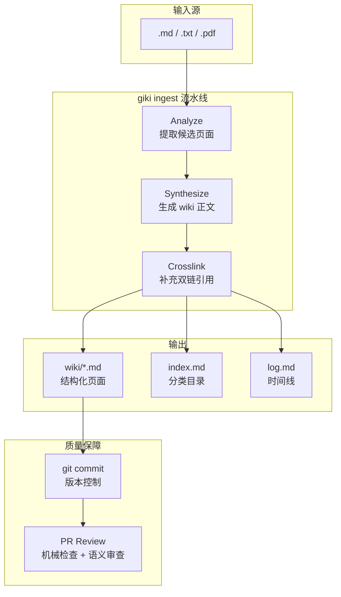

# giki

**用软件工程方法做 LLM Wiki -- 知识的持续集成（Knowledge CI/CD）**

[English](../README.md) | 详细设计文档: [giki-v0.1-design.md](superpowers/specs/2026-06-30-giki-v0.1-design.md)

---

## 项目定位

现有的 LLM 知识管理方案通常依赖 RAG（查询时检索）或简单的对话工具，缺少对知识质量的系统性管控。giki 提出了一条不同的路径：在文档入库时就将其"编译"为结构化的 wiki 页面，并借助 git 版本控制和 PR Review 机制持续保障质量。

核心理念可以概括为一句话：**像做 CI/CD 一样做知识管理。**

- **编译时处理，而非查询时检索。** 原始文档经过 LLM 分析、综合、双链三步流水线，产出高质量的 wiki 页面。
- **每次修改都有 git 记录。** 所有 AI 生成的内容都通过 git commit 追踪，可 diff、可回滚、可审查。
- **机器审查 + 语义审查双保险。** PR Review Bot 同时执行机械校验和 LLM 语义审查，确保 wiki 的一致性和准确性。

## 核心特性

### 1. 两步编译流水线

原始文档经过三个阶段处理：

1. **Analyze** -- LLM 分析源文档，提取候选页面清单（标题、摘要、关键概念）。
2. **Synthesize** -- 根据候选清单生成正式 wiki 页面正文，包含 frontmatter 元数据。
3. **Crosslink** -- 扫描全库，在相关页面之间补充 `[[wikilink]]` 双链引用。

### 2. Git 原生版本控制

每次 `ingest` 操作自动创建 git 分支并提交 commit。所有 AI 修改都可通过 `git diff` 审查，不满意可随时回滚。支持 `--branch` 参数指定自定义分支名。

### 3. PR Review Bot

`giki review` 提供两层审查：

- **机械检查** -- 断链检测、frontmatter 格式校验、index 文件同步性验证。
- **LLM 语义审查** -- 逐页调用 LLM 评估内容准确性、完整性、表述质量，输出评分和建议。

支持 `--post` 将审查结果发布到 GitHub PR 评论。

### 4. 智能索引

自动维护两个索引文件：

- `index.md` -- 分类目录，按主题聚合页面。
- `log.md` -- 时间线，按入库时间排列页面。

每次 ingest 和 review 后自动更新，无需手动维护。

### 5. Obsidian 兼容

输出为标准 Markdown + YAML frontmatter + `[[wikilink]]` 语法，可直接用 Obsidian 打开并浏览，无需额外转换。

## 架构概览



## 快速开始

### 环境要求

- Python >= 3.11
- Git

### 安装

```bash
pip install giki-gitwiki
```

### 初始化知识库

```bash
giki init
```

该命令在当前目录创建知识库结构（`wiki/`、`sources/`、配置文件等）。添加 `--with-action` 可同时生成 GitHub Actions 工作流文件。

### 配置 LLM

```bash
giki config set llm.provider anthropic
giki config set llm.api_key sk-ant-xxx
```

也支持 OpenAI 兼容接口（含 Ollama、vLLM、LM Studio）：

```bash
giki config set llm.provider openai
giki config set llm.base_url http://localhost:11434/v1
giki config set llm.model llama3
```

### 导入文档

```bash
# 导入单个文件
giki ingest notes/meeting.md

# 导入多个文件
giki ingest docs/*.md docs/*.pdf

# 指定分支名
giki ingest report.pdf --branch feature/quarterly-report

# 预览模式（不实际写入）
giki ingest draft.md --dry-run
```

### 审查

```bash
# 审查当前分支
giki review

# 审查指定 PR
giki review --pr 42

# 输出 JSON 格式
giki review --json
```

## 命令参考

| 命令 | 说明 | 常用参数 |
|------|------|----------|
| `giki init` | 初始化知识库 | `--with-action` 生成 CI 配置 |
| `giki ingest <path...>` | 编译原始文档 | `--branch` 指定分支, `--yes` 跳过确认, `--dry-run` 预览, `--retry-failed` 重试失败项 |
| `giki review` | PR 审查 | `--pr N` 指定 PR, `--post` 发布评论, `--json` JSON 输出 |
| `giki config` | 配置管理 | `show` 查看, `set` 修改, `tips` 优化建议 |

## 配置

通过 `giki config` 管理，配置项包括：

| 配置项 | 说明 | 示例值 |
|--------|------|--------|
| `llm.provider` | LLM 提供商 | `anthropic` / `openai` |
| `llm.api_key` | API 密钥 | `sk-ant-...` |
| `llm.base_url` | API 地址（OpenAI 兼容） | `http://localhost:11434/v1` |
| `llm.model` | 模型名称 | `claude-sonnet-4-20250514` |

使用 `giki config tips` 可获取针对当前配置的优化建议。

## 已知限制

当前版本（v0.1 alpha）存在以下限制：

1. **PDF 不做 OCR** -- 扫描型 PDF（图片格式）会被拒绝，仅支持文本型 PDF。
2. **不支持远程数据源** -- 暂不支持 URL、Notion、Confluence 等远程来源，仅支持本地文件（`.md`、`.txt`、`.pdf`）。
3. **Wikilink 功能有限** -- 不支持 `#heading` 锚点、`^block-id` 块引用、`![[embed]]` 嵌入语法。
4. **wiki 目录平铺** -- 所有页面存放在 `wiki/` 根目录，不支持子目录分类。
5. **断点续传需手动触发** -- 流水线中断后需使用 `--retry-failed` 手动重试，不会自动恢复。
6. **不内置 token 预估** -- 无法提前估算 LLM 调用的 token 消耗。

## 路线图

### v0.2

- 类型化 Wikilink（`[[page|alias]]`、带类型标注的链接）
- AI Merge（智能合并冲突解决）
- `branch` / `pr` 协作命令，支持多人并行编辑

### v0.3

- 本地 Web UI（基于 D3 的知识图谱可视化）
- Q&A 模块（基于 RAG 的问答能力）
- 跨域知识融合（多知识库互联）

## 技术栈

Python 3.11+ / Typer / GitPython / pypdf / httpx / PyYAML

## 许可证

详见项目根目录 LICENSE 文件。
