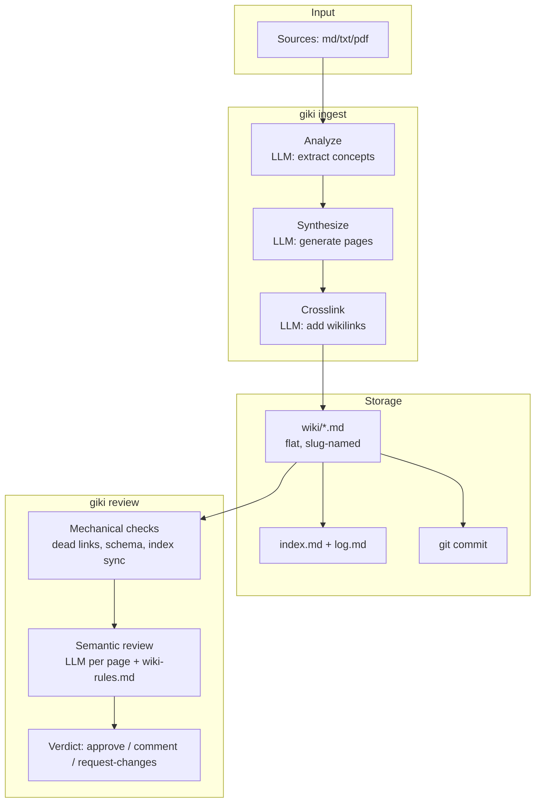

# Compilation Pipeline

The **Compilation Pipeline** is the core process within [[giki]] where raw source documents (such as markdown, text, and PDF files) are transformed into a navigable knowledge graph. Following a "compile, don't retrieve" philosophy, giki compiles sources *once* at ingest time rather than searching through raw documents at query time. This results in structured, interlinked wiki pages that can be browsed directly in tools like Obsidian.

## The Three Stages of Compilation

The pipeline consists of three distinct LLM-driven stages:

1. **Analyze**: The LLM extracts candidate concepts from the source document chunks.
2. **Synthesize**: The LLM generates or rewrites the wiki pages based on the extracted concepts.
3. **Crosslink**: The LLM interlinks the newly created or updated pages by adding `[[wikilinks]]` and `## Related` blocks.

## Architecture

The flow of the compilation pipeline—from ingesting sources to storage and subsequent review—is illustrated in the architecture diagram below:

Once the Analyze, Synthesize, and Crosslink stages are complete, the resulting flat, slug-named markdown files are saved to the `wiki/` directory. Smart indexing files (`index.md` and `log.md`) are automatically maintained, and the entire ingestion is saved as a clean, git-native commit.
